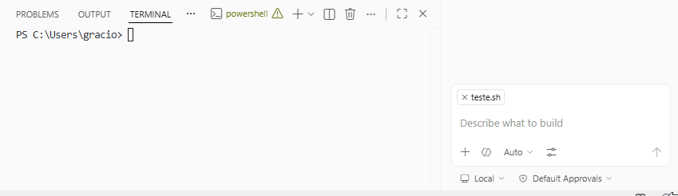
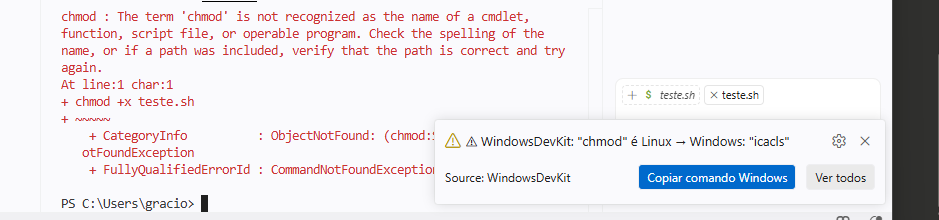
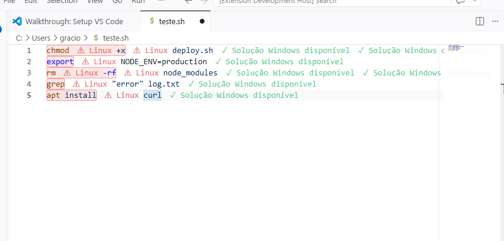

# WindowsDevKit 🪟

> **Every tutorial assumes you're on Linux or Mac. WindowsDevKit fixes that.**

`chmod +x`, `export PATH=...`, `rm -rf` — none of it works in PowerShell. WindowsDevKit detects Linux/Mac commands automatically and shows you the Windows equivalent **before you even have to Google it**.



[](https://github.com/hyatechbr-max/windowsdevkit)
[](LICENSE)
[](https://code.visualstudio.com/)
[](https://github.com/hyatechbr-max/windowsdevkit/issues)

---

## How it works

**In the terminal** — you run a Linux command, Windows says "not recognized", and a notification appears instantly with the Windows equivalent and a copy button.



**In the editor** — open any file with Linux commands and they get underlined in red, with the fix available right there via hover or quick action.



---

## Installation (beta)

> ⚠️ The `.vsix` one-click installer is coming soon. For now, run from source in under 2 minutes.

**Requirements:** [VSCode](https://code.visualstudio.com/) · [Node.js LTS](https://nodejs.org/)

```bash
git clone https://github.com/hyatechbr-max/windowsdevkit
```

1. Open the folder in VSCode: `File → Open Folder → select the windowsdevkit folder`
2. Press **F5** — a new Extension Development Host window opens with the extension active
3. In the new window's terminal, test it:

```bash
chmod +x test.sh
```

You should see a notification appear automatically with the Windows equivalent.

---

## What it detects

40+ commands in the database and growing.

| Linux / Mac | Windows (PowerShell) |
|---|---|
| `chmod +x file.sh` | `icacls file.ps1 /grant Everyone:RX` |
| `export NODE_ENV=production` | `$env:NODE_ENV = "production"` |
| `rm -rf node_modules` | `rmdir /s /q node_modules` |
| `grep "error" log.txt` | `findstr "error" log.txt` |
| `cat file.txt` | `type file.txt` |
| `touch newfile.js` | `echo.> newfile.js` |
| `which node` | `where node` |
| `ls -la` | `dir /a` |
| `apt install curl` | `winget install curl` |
| `kill 1234` | `taskkill /PID 1234` |

---

## For vibe coders — Cursor and Windsurf

If you use Cursor or Windsurf, we have ready-made rules files that make the AI generate Windows-compatible code **directly** — no fixing needed afterwards.

- **[Download `.cursorrules`]()** → drop it in your project root → Cursor now generates PowerShell automatically
- **[Download `.windsurfrules`]()** → same result in Windsurf

---

## Roadmap

- [ ] VSCode Marketplace publication
- [ ] `.vsix` file for one-click install (no source code needed)
- [ ] Browser extension (works on any tutorial website)
- [ ] GitHub Copilot instructions support

---

## Feedback

This extension is in beta and I need your honest feedback.

If you find a missing command or something that doesn't work as expected, **[open an issue](https://github.com/hyatechbr-max/windowsdevkit/issues)** — every report directly shapes what gets built next.

---

## License

MIT — free to use, modify and distribute with credit to the original project.

---

*Built for Windows developers who are tired of being second-class citizens in the dev world.*
